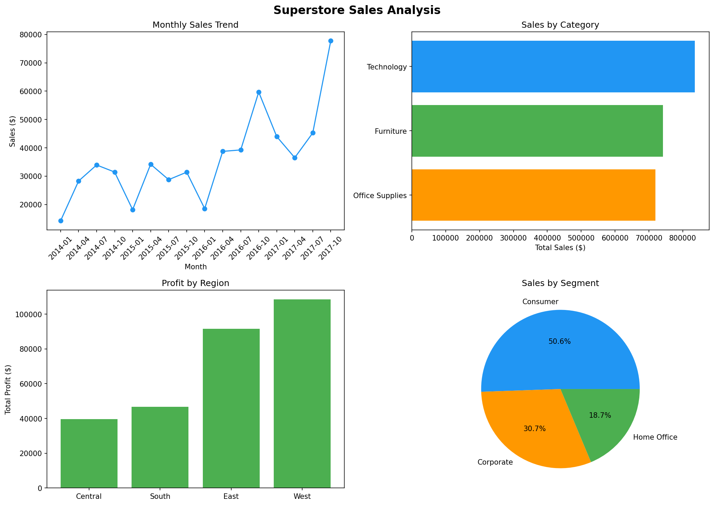
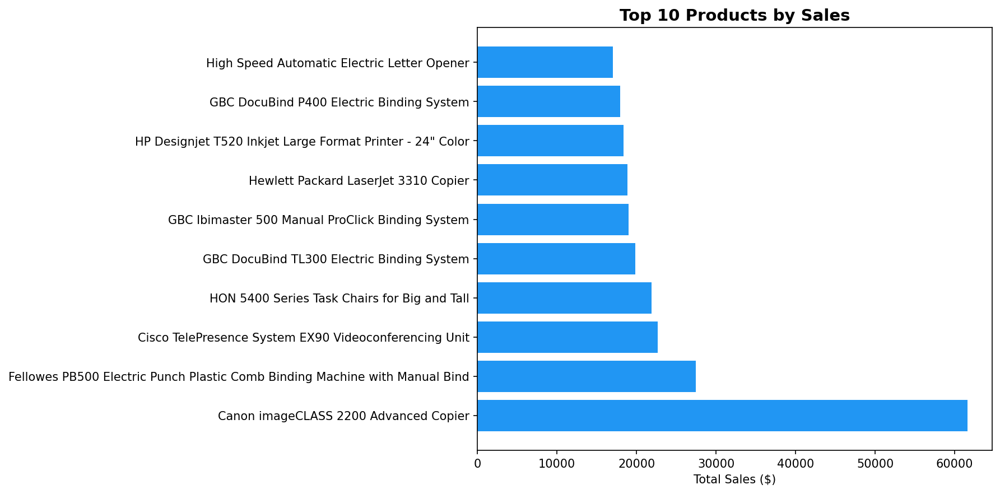
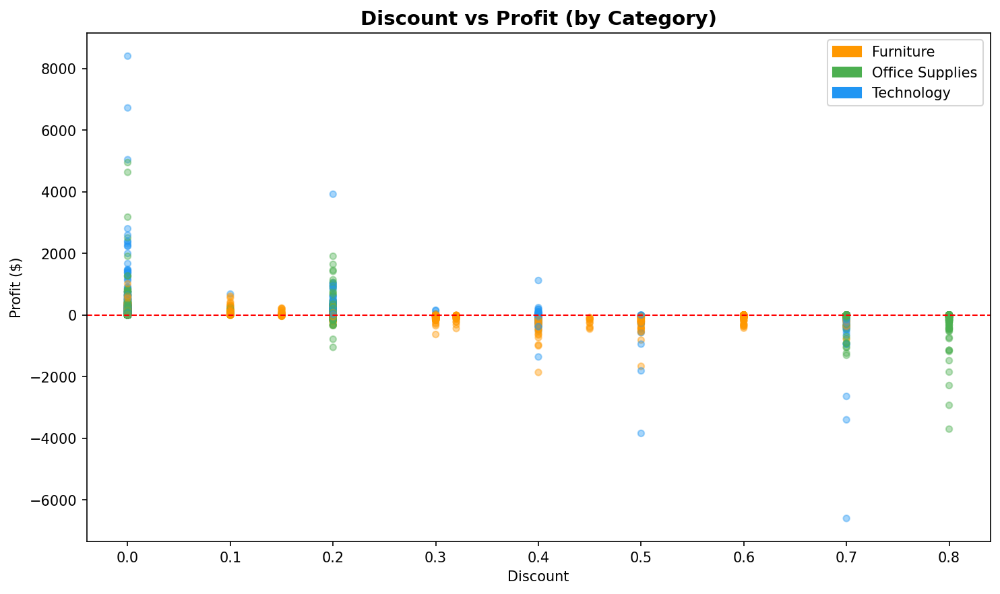
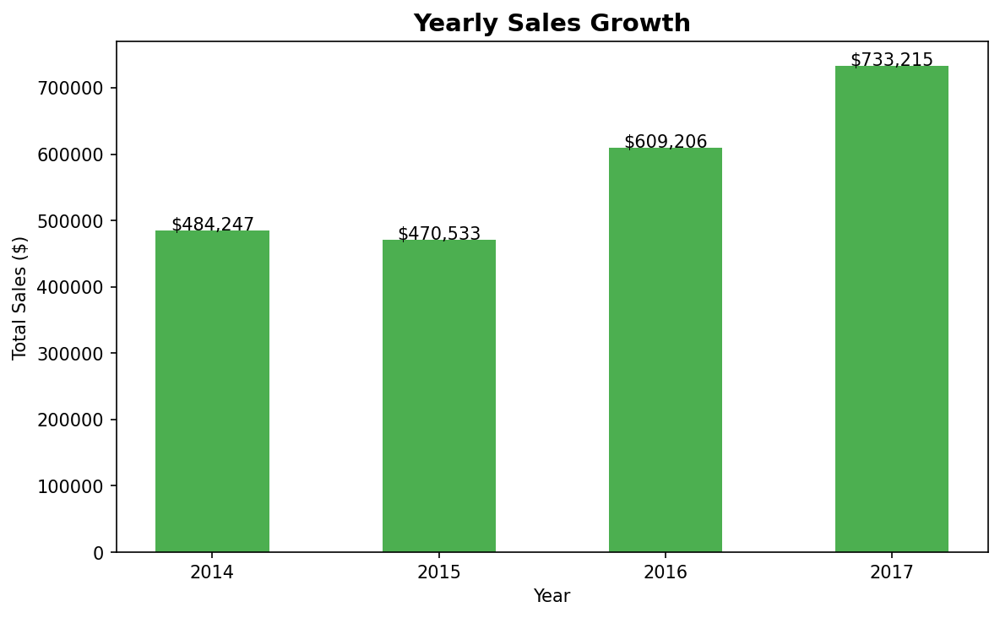

# 🛒 Superstore Sales Analysis

A comprehensive exploratory data analysis (EDA) of the Superstore retail dataset,
uncovering sales trends, profitability drivers, and actionable business insights
using Python.

---

## 📊 Key Findings

| # | Insight |
|---|---------|
| 1 | **Technology** is the most profitable category ($145,455 total profit) |
| 2 | **West region** leads in sales ($725,458), South is the lowest ($391,722) |
| 3 | Total sales grew **+51.4%** from 2014 to 2017 |
| 4 | Orders with **discounts ≥ 30%** average a loss of $97.18 per order |
| 5 | **Consumer segment** generates the highest revenue ($1,161,401) |

---

## 📁 Project Structure
```
sales-data-analysis/
│
├── data/
│   └── superstore.csv          # Source dataset (Kaggle)
├── outputs/
│   ├── sales_overview.png      # 4-panel overview chart
│   ├── top10_products.png      # Top 10 products by revenue
│   ├── discount_vs_profit.png  # Discount impact analysis
│   └── yearly_growth.png       # Year-over-year growth
│
├── sales_analysis.py           # Main analysis script
├── requirements.txt            # Dependencies
└── README.md
```

---

## 🛠️ Tech Stack

- **Python 3.x**
- **pandas** — data cleaning & aggregation
- **matplotlib** — data visualization
- **seaborn** — statistical plots

---

## ⚙️ How to Run
```bash
# 1. Clone the repository
git clone https://github.com/pn849222-hub/sql-query-portfolio.git
cd sales-data-analysis

# 2. Install dependencies
pip install -r requirements.txt

# 3. Add dataset
# Download from: https://www.kaggle.com/datasets/vivek468/superstore-dataset-final
# Place as: data/superstore.csv

# 4. Run analysis
python sales_analysis.py
```

---

## 📈 Visualizations

### Sales Overview


### Top 10 Products


### Discount vs Profit


### Yearly Growth


---

## 💡 Business Recommendations

1. **Reduce high discounts** — orders with ≥30% discount lose money on average.
   Cap discounts at 20% to protect margins.
2. **Invest in Technology** — highest profit margin across all categories.
3. **Grow the South region** — significant gap vs West suggests untapped potential.
4. **Focus on Consumer segment** — largest revenue contributor, prioritize retention.

---

## 📂 Dataset

- **Source:** [Kaggle — Superstore Dataset](https://www.kaggle.com/datasets/vivek468/superstore-dataset-final)
- **Records:** 9,994 orders
- **Period:** January 2014 – December 2017
- **Features:** 21 columns including sales, profit, discount, region, category

---

*Developed as part of a Data Analytics portfolio project.*
